# JO's restaurant-app

This restaurant booking application is designed to help restaurant owners keep track of their bookings and also enable users to easily make restaurant reservations. This application offers the user the ability to make a reservation, edit their reservation or even cancel a reservation without necessarily having to get intouch with the restaurant.

All these features are the building blocks of this application, but also the site owner has the ability to monitor the inflow of reservations and better plan his or her day basing on the reservations made.

The application is powered by Python, using a Django web framework. The user interface is crafted using a mixture of HTML,Bootstrap, CSS and JavaScript. Furthermore, it is deployed on Heroku, a cloud platform as a service (PaaS).

Its a responsive site as illustrated below.

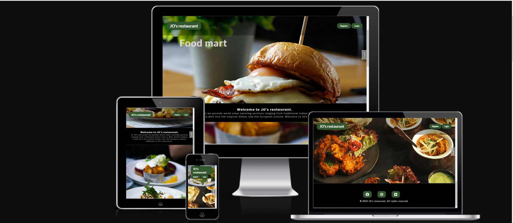

# User stories
Features in this project were structured based on the
[user stories](https://github.com/users/Allano256/projects/3)

<ul>
<li><strong>Description Of Service:</strong> This field t describes the specific service, feature, or screen that the user story relates to.</li>
<li><strong>User Objective:</strong> This field outlines the user's goal or objective. It should clearly state what the user wants to achieve or accomplish. The format follows: "As a user, I want to [action], so that [reason or benefit]." With this Objective in mind..</li>
<li><strong>Acceptance Criteria:</strong> This field specifies the conditions or criteria that must be met for the user story to be considered complete. It helps define the boundaries and expectations for implementing the user story.</li>
</ul>

# Features

<ul> 
 <ol> <strong> Navigation Bar</strong> </ol>
 <li>The navigation bar is featured on all the different pages of the application, having features like signup, log in, log out, make reservation, show reservation. </li>
 <li>These different features enable the user to register their details as customers, be able to log in as registered users and make reservations. They can also always come back and make any changes to their reservation.</li>
</ul>

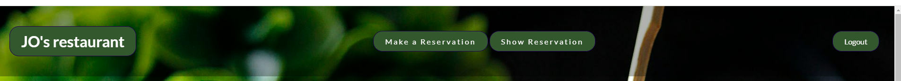

<ul> 
<ol> <strong>The landing page</strong> </ol>
<li>The landing page has four distinctive images of food and a midsection with a welcome message.</li>
<li>The bright images used in this section capture the customers eye and reflect the quality of food that the user should expect at the restaurant.  </li>
</ul>

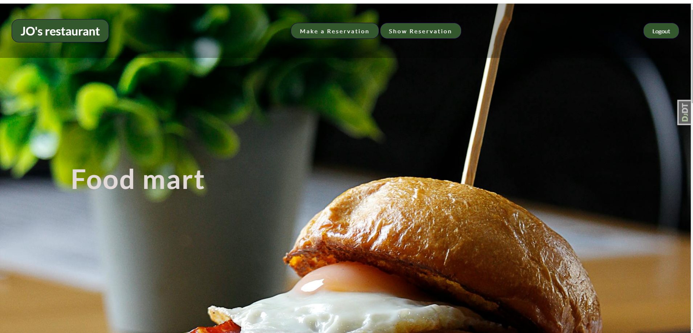
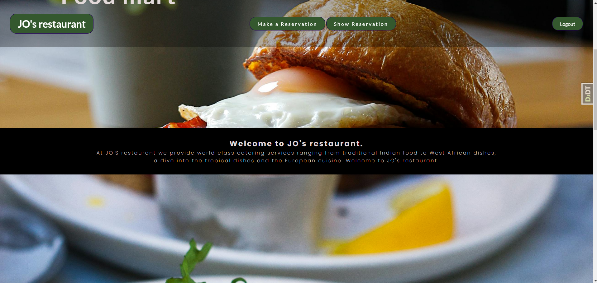
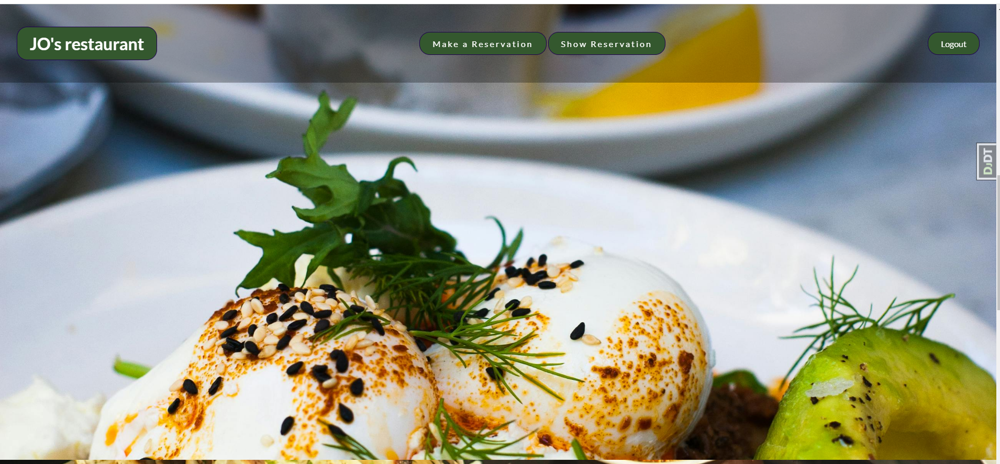
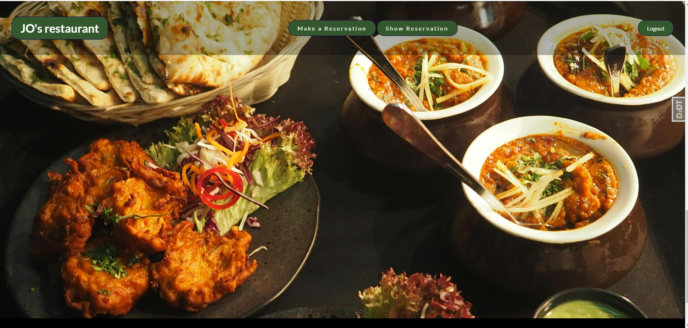

<ul> 
<ol> <strong>The Footer</strong> </ol>
<li>The footer section includes the links to the restaurants relevant social medias of JO's Restaurant and these links will open in a new tab for easier navigation.</li>
<li>The footer is valuable to the user as it encourages them to keep connected via social media.</li>
</ul>

<ul> 
<ol> <strong>Make a reservation</strong></ol>
<li>This page provides the user with a form that he/she can fillout details,example their name,email, phone number,number of guests, date, expected time and also the possibility to leave a message to the restaurant.</li>
</ul>

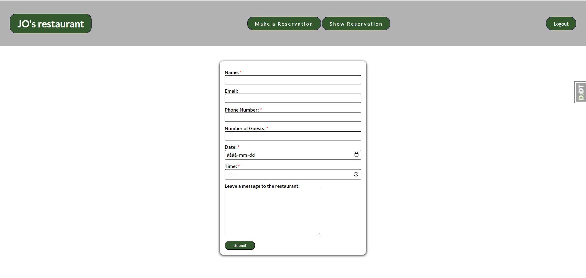

<ul> 
<ol> <strong>Show reservation</strong></ol>
<li>This section of the application allows the user to view their reservation so that its accurate, plus a list of the other reservations that have been made. The user can further go in and view a specific reservation.</li>

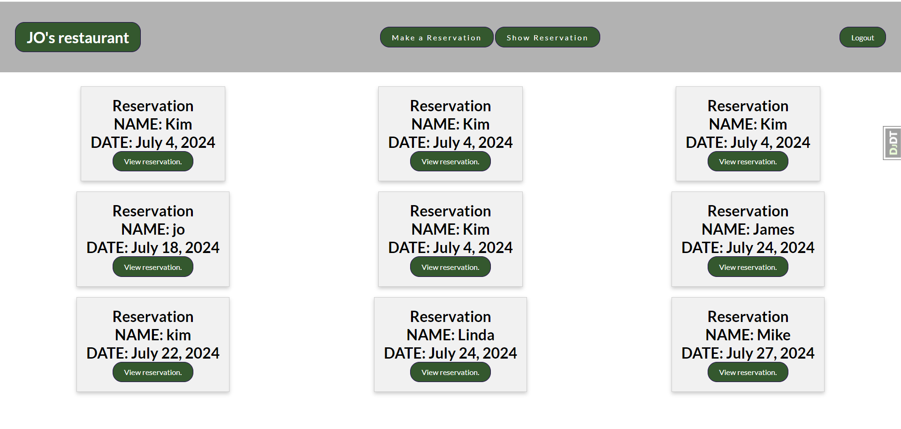

<li>Further still the user has the option to edit their reservation or cancel the reservation on this page. Incase the user accidentally went to the delete option, a modal is there to confirm or check so that the reservation is not deleted by accident. </>
</ul>

<ul>
<ol><strong>Register</strong></ol>
<li> The register or signup page allows the user to fillout a form with their details that are saved on the restaurants database, in so doing next time they come to the site to make a reservation their details are already available to ease to booking process.</li>
<li>As a signedup user, they can have access to their booking and be able to make changes to their reservation if need be. They can edit their reservation or even cancel the reservation.</li>
</ul>

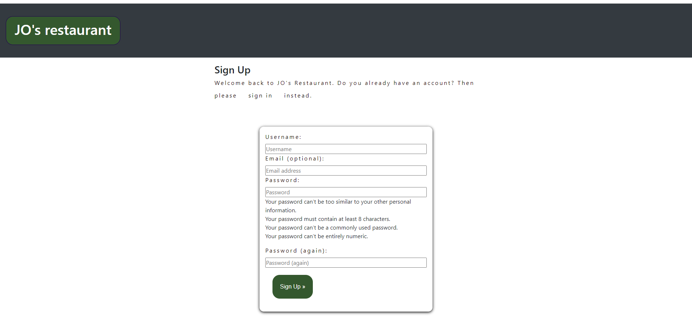

<ul>
<ol><strong>Log in</strong></ol>
<li>This page will allow the user to log in after registering their credentials. </li>
</ul>

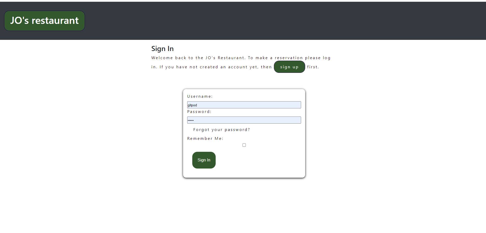

<ul>
<ol><strong>Log Out</strong></ol>
<li>The log out page enables the user to exit the application after making their reservation.</li>
</ul>

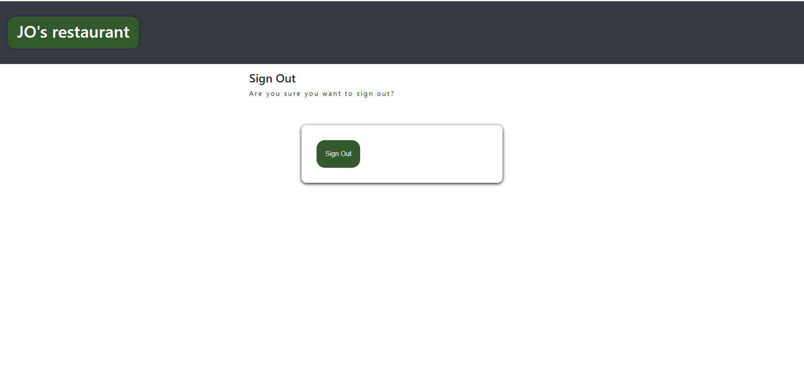

# Design

The application layout was designed by hand on features of the landing page.
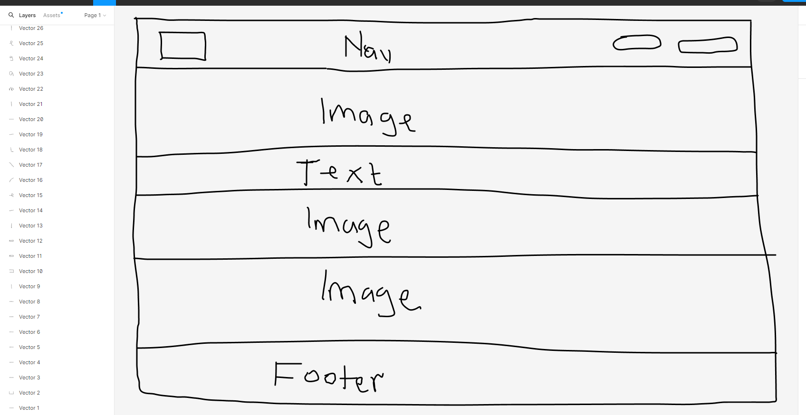

<ul>
<ol><strong>Features not implemented</strong> </ol>

<li>We did not include a menue since the restaurant is meant to cover alot of dishes and we would never exhaust all the meals.</li>
<li>The ability for a user to delete their account.</li>
<li>The ability for a user to reset their password incase they forgot it.</li>

</ul>

<ul>
<ol><strong>Testing</strong></ol>
<li>HTML, W3C was used to validate the project for any errors. The project did not have any errors and was successfull.
The site tested HTML and CSS for the application.</li>

[restaurant_app](https://validator.w3.org/)

<li>Javascript, JS Hint was used to validate the javascript for any errors. The project did not have any errors an was successful.
Code from the javascript file was copied and pasted into the JS Hint application for tesing which didnt produce any errors.</li>

[restaurant_app](https://jshint.com/)

<li>Manual testing was done on the different parts of the software to ensure that it works as it should</li>
<li>Manual testing was done on the form to ensure that fields that have an asterik must be filledout for the form to be considered valid.</li>

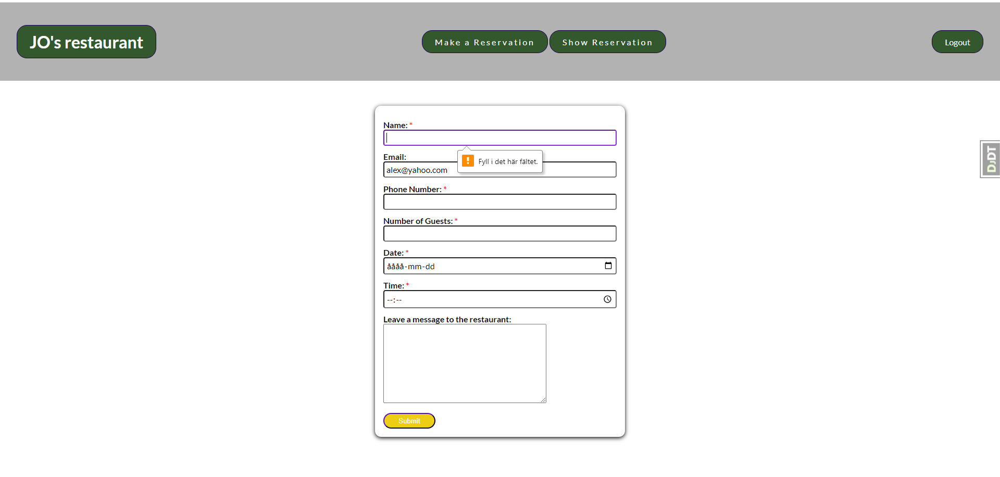

<li>The log in form was also tested to ensure that only signedup users can log into the application. This is indicated by the message provided to the user incase wrong details are entered during the login process.</li>

<li>The site was tested to ensure interaction with the user by always displaying a message to the user to indicate what part of the process they are at.</li>

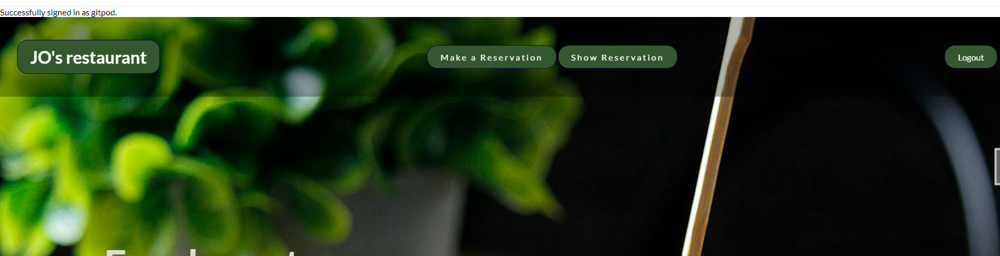

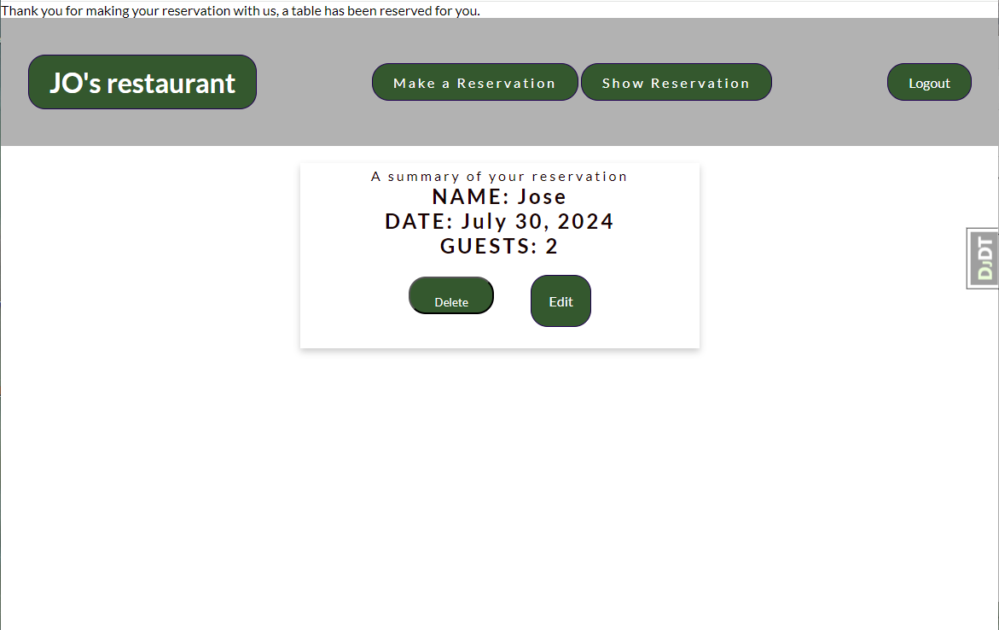

<li>The application was setup to ensure that when a customer comes to edit their reservation, a prefilled form exists for updating.</li>

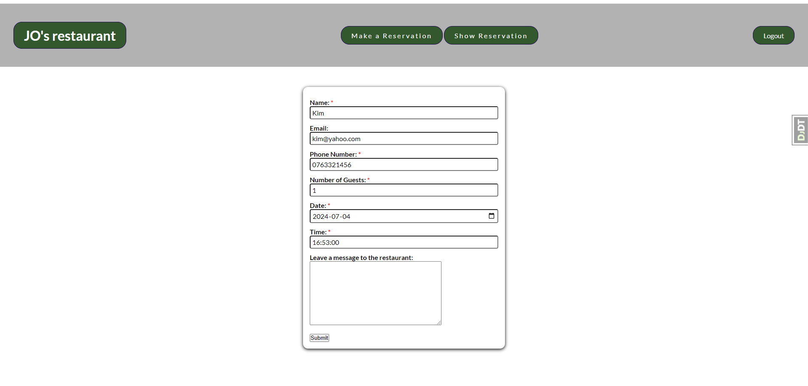

<li>The application was also tested to ensure that a customer only books valid dates and they cant book dates that have passed.</li>

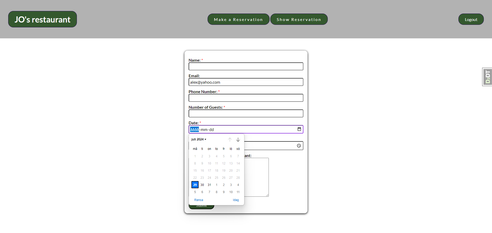

The live link can be found here;

[restaurant_app](https://allano256.github.io/restaurant_app/)

</ul>

The project was deployed on the GitHub hosting platform and below are the steps taken to achieve the feat.
<ul>
<ol><strong>Deployment</strong></ol>
<li>Log into your account in github</li>
<li>Go to the repository of restaurant_app
</li>
<li>Click on the code button,and copy your preffered clone link. </li>
<li>Open the terminal in your code editor and change the current working directory to the location you want to use for the cloned directory.</li>
<li>Use git clone into the terminal, paste the link you copied in step 3 and press enter.</li>

<ul>
<ol> Deployment using Heroku</ol>
<li>Register for an account on Heroku or sign in.</li>
<li>Create a new app.</li>
<li>Give your app a name.</li>
<li>Connect your github repository to Heroku app.</li>
<li>Create a Live Database by adding the postgreSQL add-on.</li>
<li>Create a Cloudfare Account and set up a R2 Bucket.</li>
<li>Create and Set up an email account for verification mails.</li>
<li>Set Config Vars for your cloudfare bucket (AWS_S3_SECRET_ACCESS_KEY), database (DATABASE_URL) and email(EMAIL_HOST_PASSWORD).</li>
<li>Deploy from "deploy", or choose an automatic deploy option.</li>

</ul>
The deployed version can be found via this link on Heroku,

[restaurant_app](https://restaurant256-cba0e80966cc.herokuapp.com/)

</ul>

<ul>
<ol><strong>Content</strong></ol>

<li> The images on the hero section were taken from pexels</li>

[pexels](https://pexels.com/sv-se/)

<li>The icons used in the footer were taken from Font awesome.</li>

[font awesome](https://fontawesome.com)

<li> The font used was 'Lato' and 'poppins'.</li>

</ul>

## Colors used

We used color green for all of our buttons and white for the text.(#ffffff and hex(34582e))

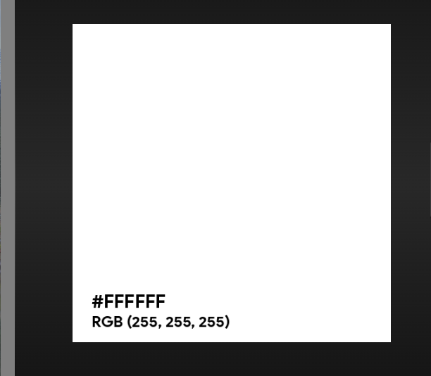

#### Early deployment.

It was important for me to do early deployment as i was able to see the output,shared the link with other friends to test on their devices and was able to solve the issue. 

## Technologies used

<ul>
<li>GitHub, this was used for storage and deployment</li>
<li>VS CODE, Editor</li>
<li>Heroku - Deployment</li>
</ul>

## Feedback

If you have any feedback, please reach out to us at allanzizinga@yahoo.com
