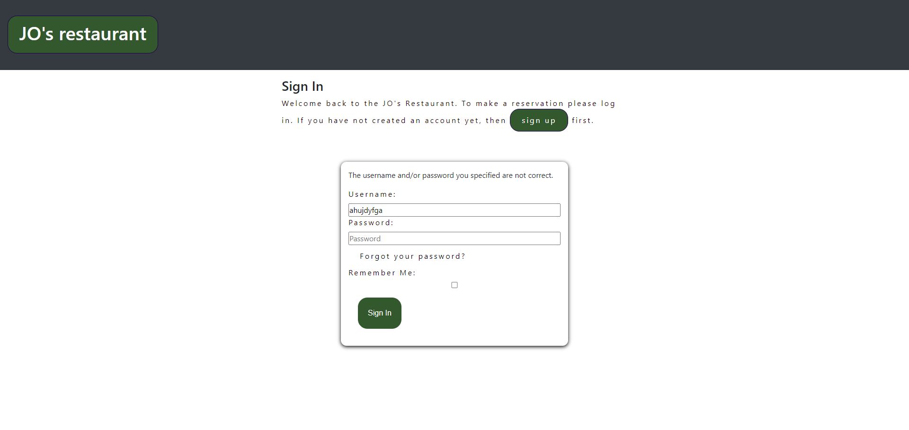

# restaurant_app

This restaurant booking application is designed to help restaurant owners keep track of their bookings and also enable users to easily make restaurant reservations. This application offers the user the ability to make a reservation, edit their reservation or even cancel a reservation without necessarily having to get intouch with the restaurant. All these features are the building blocks of thIS application, but also the site owner has the ability to monitor the inflow of reservations and better plan his or her day basing on the reservations made. 
Its a responsive site as illustrated below.

# Features

Existing Features

<ul> 
 <ol>Navigation Bar </ol>
 <li>The navigation bar is featured on all the different pages of the application, having features like signup, log in, log out, make reservation, show reservation. </li>
 <li>These different features enable the user to register their details as customers, be able to log in as registered users and make reservations. They can also always come back and make any changes to their reservation.</li>
</ul>

<ul> 
<ol>The landing page </ol>
<li>The landing page has four distinctive images of food and a midsection with a welcome message.</li>
<li>The bright images used in this section capture the customers eye and reflect the quality of food that the user should expect at the restaurant.  </li>
</ul>

<ul> 
<ol>The Footer</ol>
<li>The footer section includes the links to the restaurants relevant social medias of JO's Restaurant and these links will open in a new tab for easier navigation.</li>
<li>The footer is valuable to the user as it encourages them to keep connected via social media.</li>
</ul>

<ul> 
<ol>Make a reservation</ol>
<li>This page provides the user with a form that he/she can fillout details,example their name,email, phone number,number of guests, date, expected time and also the possibility to leave a message to the restaurant.</li>
</ul>

<ul> 
<ol>Show reservation</ol>
<li>This section of the application allows the user to view their reservation so that its accurate, plus a list of the other reservations that have been made. The user can further go in and view a specific reservation.</li>

<li>Further still the user has the option to edit their reservation or cancel the reservation on this page. Incase the user accidentally went to the delete option, a modal is there to confirm or check so that the reservation is not deleted by accident. </>
</ul>

<ul>
<ol>Register</ol>
<li> The register or signup page allows the user to fillout a form with their details that are saved on the restaurants database, in so doing next time they come to the site to make a reservation their details are already available to ease to booking process.</li>
<li>As a signedup user, they can have access to their booking and be able to make changes to their reservation if need be. They can edit their reservation or even cancel the reservation.</li>
</ul>

<ul>
<ol>Log in</ol>
<li>This page will allow the user to log in after registering their credentials. </li>
</ul>

<ul>
<ol>Log Out</ol>
<li>The log out page enables the user to exit the application after making their reservation.</li>
</ul>

#Testing
<ul>
<ol>Validating Testing</ol>
<li>HTML, W3C was used to validate the project for any errors. The project did not have any errors an was successful.</li>
<li>Manual testing was done on the different parts of the software to ensure that it works as it should</li>
<li>Manual testing was done on the form to ensure that fields that have an asterik must be filledout for the form to be considered valid.</li>

<li>The log in form was also tested to ensure that only signedup users can log into the application. This is indicated by the message provided to the user incase wrong details are entered during the login process.</li>

<li>The site wass tested to ensure interaction with the user by always displaying a message to the user to indicate what part of the process they are at.</li>

<li>The application setup to ensure that when a customer comes to edit their reservation, a prefilled form exists for updating.</li>

<li>The application was also tested to ensure that a customer only books valid dates and they cant book dates that have passed.</li>

<li>PYTHON</li>
<li>JAVASCRIPT</li>

The live link can be found here;

</ul>

#Deployment
The site was  deployed on Heroku and Github.
<ul>
<li>The site was deployed to GitHub pages. The steps to deploy are as follows:
<li>In the GitHub repository, navigate to the Settings tab</li>
<li>From the source section drop-down menu, select the Master Branch </li>
<li>Once the master branch has been selected, the page will be automatically refreshed with a detailed ribbon display to indicate the successful deployment.</li>

The deployed version can be found via this link on Heroku,

</ul>

#Credits
<ul>
<ol>Content</ol>
<li> The images on the hero section were taken from pexels</li>

[pexels](https://pexels.com/sv-se/)

<li>The icons used in the footer were taken from Font awesome.</li>

[font awesome](https://fontawesome.com)

</ul>

## Colors used

We used color green for all of our buttons and white for the text.(#ffffff and hex(34582e))

## Issues faced

#### Early deployment.

It was important for me to do early deployment as i was able to see the output,shared the link with other friends to test on their devices and was able to solve the issue. 

## Lessons Learned

## Technologies used

1. The website is a combination of Html, Css, Javascript, Python.

2. Used git, heroku and github features aswell.

## Deployment

The project was deployed on the GitHub hosting platform and below are the steps taken to achieve the feat.

1. Log into your account in github

2. Go to the repository of restaurant_app

3. Click on the code button,and copy your preffered clone link.

4. Open the terminal in your code editor and change the current working directory to the location you want to use for the cloned directory.

5. Use git clone into the terminal, paste the link you copied in step 3 and press enter.

## Feedback

If you have any feedback, please reach out to us at allanzizinga@yahoo.com
